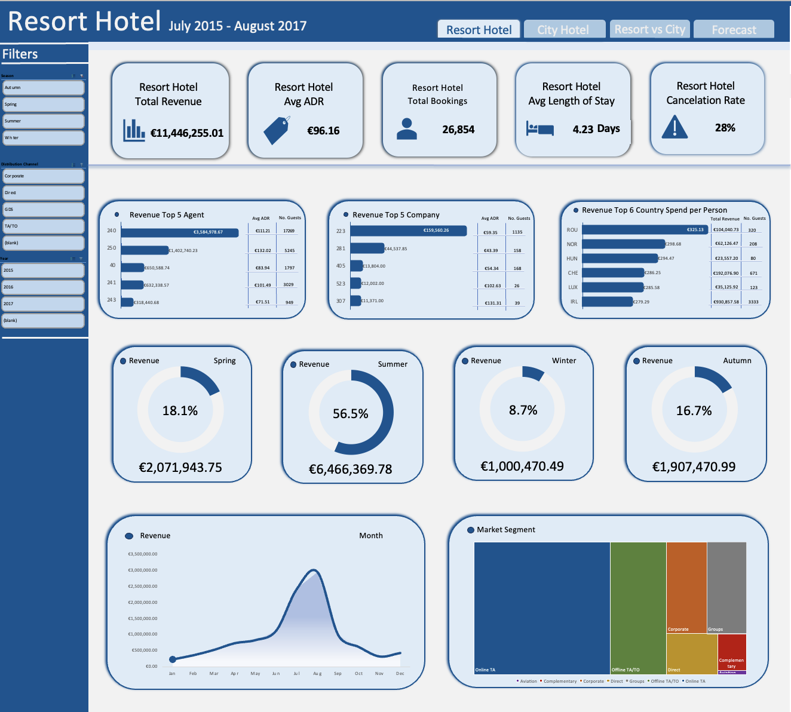
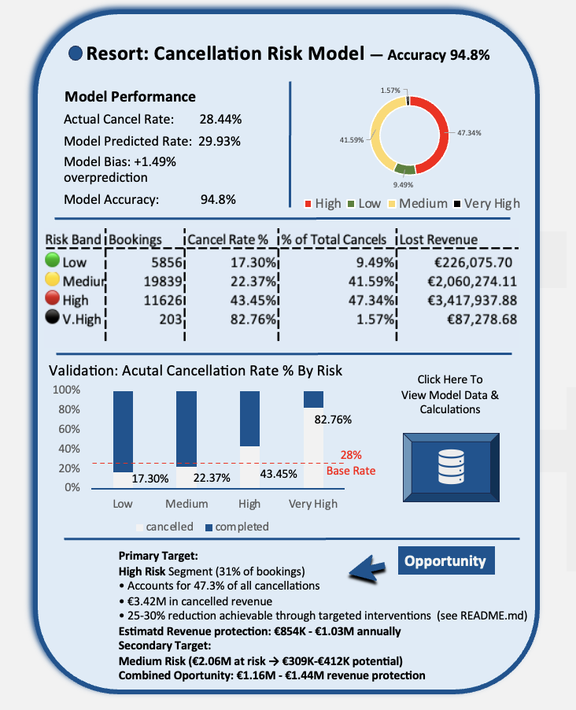

# Hotel Booking Cancellation Risk Model (Excel Project)

This project analyzes hotel (almost) entirely in Excel.  
It includes 4 interactive dashboards, feature-engineered risk scoring logic, validation checks, and scenario analysis tools and build a predictive cancellation-risk scoring model designed to optimize hotel revenue and operational efficiency.
The project demonstrates an end-to-end analytical workflow, integrating spreadsheet tools with advanced statistical modeling:

Initial Analysis (Excel):

Developed interactive dashboards, feature engineering, and a heuristic risk scoring logic (benchmarking model) to establish initial performance metrics.

Included scenario analysis and validation checks (VIF calculation) to ensure data stability.

Advanced Modeling (Python & Excel):

Implemented a Logistic Regression model using Python (statsmodels) for training, as Excel's Solver could not handle the scale and non-linearity required.

Used the fitted coefficients to calculate Logit scores and probabilities directly in Excel.

Validated Model Performance using the ROC/AUC curve (AUC = 0.776), proving superior predictive power over the baseline.

Business Optimization:

Optimized the model based on the hotel's financial goals by testing multiple cutoffs to balance Recall (mitigating high-cost missed cancellations) and Precision (minimizing wasted intervention effort).

Final Recommendation: A 0.30 probability cutoff was selected, yielding 63% Recall and 51% Precision, ensuring the model is efficient and profitable for deployment.

Next Steps (Currently In Progress):

Time-Series Validation: Testing the model's stability and generalization on 8 months of unseen 2017 data to confirm real-world robustness.

Finalizing documentation of the entire analytical process and deployment recommendations. 

## Dashboards & Model Screenshots

- **Resort Hotel Dashboard**  
  
`

- **Cancellation Risk Model**  
  

## Project Status
🔧 **Work in progress** — new features, documentation, and refinements will be added soon.
